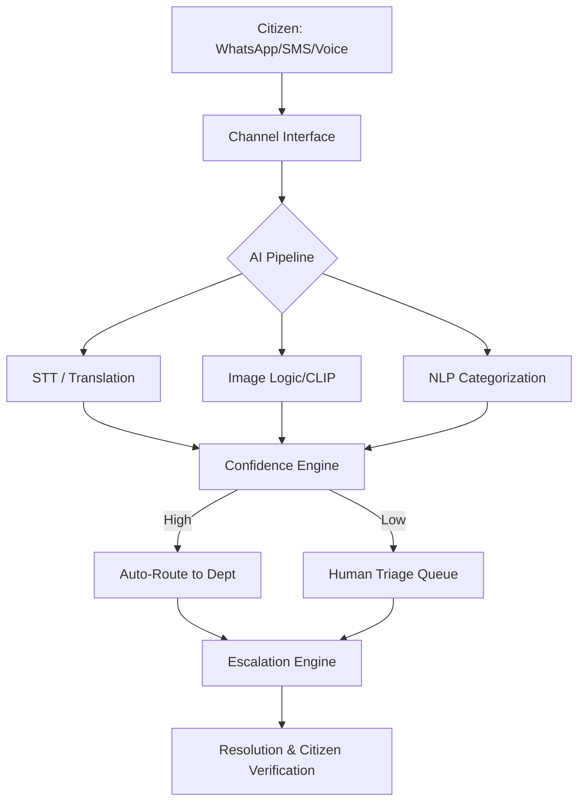

# 🇮🇳 NagrikConnect

### *The AI-Assisted Civic Workflow Engine*

**NagrikConnect** is an intelligent middleware platform designed to bridge the gap between citizens and municipal governance. Unlike traditional grievance portals that act as static forms, NagrikConnect is a **proactive routing and verification engine** that ensures every complaint is understood, prioritized, and tracked to resolution—even in digitally under-resourced municipalities.

## 🚀 Core Value Proposition

* **Inclusive Accessibility:** Native support for voice notes, regional languages (Hindi, Tamil, Telugu), and "Hinglish" via WhatsApp/SMS.
* **Intelligent Triage:** AI-driven classification, geotagging, and image verification to reduce manual administrative load.
* **Escalation Enforcement:** Automated "Dead-End" prevention—if a department ignores a ticket, the system automatically escalates it.
* **Equity by Design:** Integrated bias monitoring to ensure low-income or non-English speaking regions receive equal priority.

## 🛠 Technical Architecture

The system is built as a modular pipeline to ensure **graceful degradation**. If the Image AI fails, the Text AI still routes the ticket.

### 1. The Language Processing Pipeline

* **Speech-to-Text:** OpenAI Whisper for high-accuracy multilingual transcription.
* **Translation & Detection:** FastText for language ID; NLLB-200 (No Language Left Behind) for standardized processing.
* **Categorization:** Fine-tuned BERT/RoBERTa models mapped to a standardized civic taxonomy.

### 2. The Intelligence Core

* **Image Verification:** YOLO-based object detection (e.g., confirming a "pothole" is actually a pothole) and CLIP for relevance scoring.
* **Probabilistic Deduplication:** A weighted algorithm combining **Text Embeddings (50%)**, **Location (30%)**, and **Time (20%)** to prevent spam and cluster mass-reports.
* **Confidence Engine:** A weighted scoring system ().

### 3. Human-in-the-Loop (HITL)

* **Batch Triage Interface:** Allows officials to review 50+ complaints at once, focusing only on low-confidence flags or duplicate clusters.

## 🚦 System Flow

## 📊 Key Features for Municipal Realism

| Feature | Description |
| --- | --- |
| **Low-Maturity Mode** | Provides a simple CSV/WhatsApp-based interface for municipalities without complex APIs. |
| **Abuse Handling** | Rate-limiting and coordinated attack detection to prevent system gaming. |
| **Bias Dashboard** | Monitors if certain languages or regions are experiencing higher rejection or slower resolution rates. |
| **Resolution Audit** | Tickets aren't "Closed" until the citizen confirms or a 7-day silent window expires. |

## 💻 Tech Stack

* **Backend:** FastAPI (Python) for high-performance async processing.
* **Data:** PostgreSQL (Relational data) + Redis (Caching/Queues).
* **Models:** Whisper (STT), BERT (NLP), YOLOv8 (Vision), FastText (LangID).
* **Infrastructure:** Dockerized microservices for independent scaling of AI modules.

## 🛡 Responsible AI & Transparency

NagrikConnect prioritizes **Explainable AI (XAI)**. Every automated routing decision is stored with:

1. **Reasoning:** Why this category was chosen.
2. **Evidence:** The specific keywords or image features that triggered the severity.
3. **Audit Trail:** An immutable log of every status change, department rejection, and escalation.

## 📈 Impact

* **For Citizens:** Reduced friction; no need to download apps or speak English to be heard.
* **For Government:** Reduced manual data entry; clear data on city "hotspots"; improved public trust.
* **For Society:** Data-driven evidence for urban planning and resource allocation.

